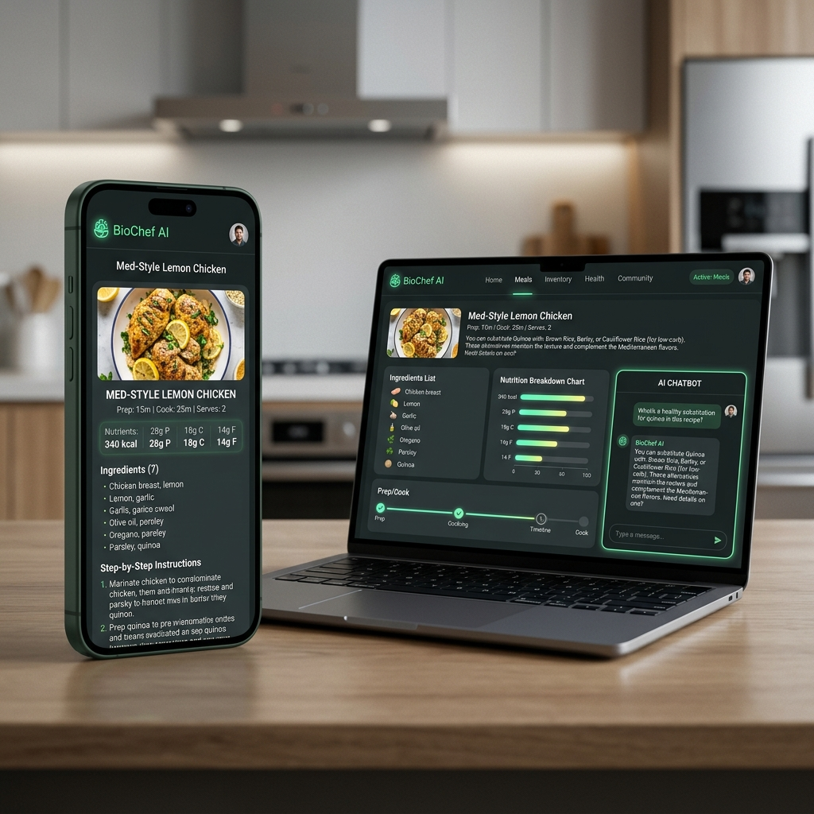

# BioChef AI — v0.4.5 "Excellence Refined"

**BioChef AI** is the state-of-the-art culinary intelligence system designed by **Davide Longo (LonDave)**. It combines ultra-fast inference with a rigorous dietary safety engine to protect your family while exploring the future of AI-driven nutrition.

---

## 🌎 Index / Indice
1. [English Version](#english-overview)
2. [Versione Italiana](#anteprima-italiana)
3. [The BioChef Protocol (Technical)](#the-biochef-protocol-technical-deep-dive)
4. [Project Roadmap](#🚀-roadmap--future-vision)
5. [Legal Shield](#⚖️-legal-shield--safety-mandatory)

---

## English Overview

### 🌟 Features Table
| Feature | Description |
| :--- | :--- |
| **Smart Brain** | Groq LLM integration with 128k context window support. |
| **Safety Guard** | `BCDietary` engine filtering non-edibles and allergens in real-time. |
| **V2 Backup** | Salted SHA-256 encrypted backups for maximum data security. |
| **Fast UX** | Isolate-driven multithreading for zero-lag UI performance. |

---

## Anteprima Italiana

### 🌟 Tabella Funzionalità
| Funzionalità | Descrizione |
| :--- | :--- |
| **Cervello AI** | Integrazione Groq LLM con supporto a contesti fino a 128k token. |
| **Scudo Sicurezza** | Motore `BCDietary` che filtra allergeni e oggetti non edibili. |
| **Backup V2** | Sistema salato con validazione SHA-256 per la massima privacy. |
| **UX Fluida** | Uso intensivo di Isolati Dart per una UI reattiva e senza lag. |

---

## 🛠️ The BioChef Protocol (Technical Deep-Dive)

### 🧩 Sliding Window Context
To maintain extreme inference speed while handling long conversations, BioChef implements a **Sliding Window** mechanism. It intelligently prunes history to stay within optimal token limits (approx. 2500 chars) without losing critical user preferences.

### 🔐 Cryptographic Hardening
Backups aren't just files; they are **Vaults**.
- **Salt**: 13-digit random salt for every export.
- **Hashing**: SHA-256 pre-validation to ensure your password is correct *before* any decryption process begins.
- **XOR Engine**: Deterministic key derivation based on user password for zero-knowledge data retention.

---

## 🚀 Roadmap & Future Vision

- [ ] **Vision Module**: Snap a photo of your fridge to auto-import ingredients.
- [ ] **E2E Cloud Sync**: Optional, encrypted cloud backup for multi-device cross-sync.
- [ ] **Smart Home Bridge**: Voice commands for kitchen hands-free operation.
- [ ] **Nutritional Tracker**: Real-time calorie and macro breakdown for generated recipes.

---

## ⚖️ Legal Shield & Safety (MANDATORY)

> [!CAUTION]
> **Safety First / La Sicurezza Prima di Tutto**
> - **EN**: AI can undergo hallucinations. Always verify ingredients and cooking methods.
> - **IT**: L'IA può generare errori (allucinazioni). Verifica sempre ingredienti e metodi di cottura.

---

## 👨‍💻 Developed by [Davide Longo (LonDave)](https://github.com/LonDave)
Copyright © 2026. Licensed under [MIT + AI Safety Clause](LICENSE).

---
*Precision. Safety. Intelligence.* / *Precisione. Sicurezza. Intelligenza.*